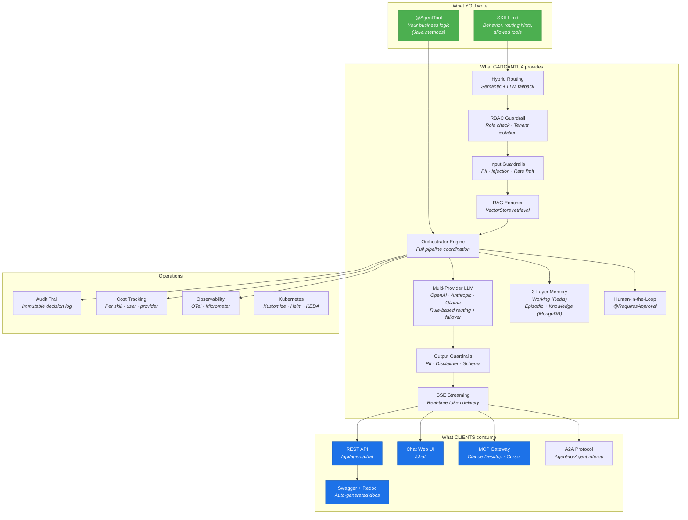

# Gargantua -- AI Agent Framework

[](LICENSE)
[](https://github.com/GiskardB/gargantua/tags)
[](https://jitpack.io/#GiskardB/gargantua)
[](https://github.com/GiskardB/gargantua/actions/workflows/ci.yml)
[](https://openjdk.org/projects/jdk/21/)
[](https://spring.io/projects/spring-boot)
[](https://docs.langchain4j.dev/)

**AI agents as a service, in Java.** Write a skill file and a tool class — Gargantua gives you a deployable REST API with streaming, persistent memory, guardrails, and multi-agent orchestration.

Define what your agent can do in a `SKILL.md` file (or a Java `@AgentSkill` annotation), implement actions as `@AgentTool` methods, and chain them into multi-step `@AgentsFlow` pipelines. The framework handles everything else: skill routing, 3-layer memory, input/output guardrails, human-in-the-loop approvals, cost tracking, A2A interoperability, and Kubernetes deployment.

Built on Java 21, Spring Boot 4.0.4, and LangChain4j.

---

## Try it in 60 seconds

> Requires: Java 21+, Maven, an OpenAI-compatible API key. No Docker needed.

```bash
# 0. (one-time) Tell Maven where to find JitPack — the maven-archetype-plugin
#    ignores -DarchetypeRepository, so the repository must live in settings.xml.
#    Append this profile to ~/.m2/settings.xml (create the file if missing):
#
# <settings>
#   <profiles>
#     <profile>
#       <id>jitpack</id>
#       <repositories>
#         <repository><id>jitpack.io</id><url>https://jitpack.io</url></repository>
#       </repositories>
#       <pluginRepositories>
#         <pluginRepository><id>jitpack.io</id><url>https://jitpack.io</url></pluginRepository>
#       </pluginRepositories>
#     </profile>
#   </profiles>
#   <activeProfiles><activeProfile>jitpack</activeProfile></activeProfiles>
# </settings>

# 1. Generate a new agent project
mvn archetype:generate \
  -DarchetypeGroupId=com.github.giskardb.gargantua \
  -DarchetypeArtifactId=agent-archetype \
  -DarchetypeVersion=v1.2.4 \
  -DgroupId=com.mycompany -DartifactId=my-agent \
  -Dversion=1.0.0 -DagentName=MyAgent -DinteractiveMode=false

# 2. Run it (embedded mode — no Docker, everything in-memory)
cd my-agent
LLM_PRIMARY_PROVIDER=openai \
LLM_PRIMARY_MODEL=gpt-4o \
LLM_PRIMARY_API_KEY=sk-your-key \
LLM_PRIMARY_ENDPOINT=https://api.openai.com/v1 \
SPRING_PROFILES_ACTIVE=embedded \
mvn spring-boot:run
#
# Provider: openai (also works for Ollama, LiteLLM, vLLM, any OpenAI-compatible)
#           anthropic | azure-openai
#           Add more via LangChain4j modules (see docs/llm-configuration.md)
#
# OpenAI-compatible examples:
#   Azure OpenAI: LLM_PRIMARY_PROVIDER=azure-openai  LLM_PRIMARY_ENDPOINT=https://your-resource.openai.azure.com
#   Ollama local: LLM_PRIMARY_PROVIDER=ollama        LLM_PRIMARY_ENDPOINT=http://localhost:11434
#   LiteLLM:      LLM_PRIMARY_PROVIDER=openai        LLM_PRIMARY_ENDPOINT=http://localhost:4000
#   vLLM:         LLM_PRIMARY_PROVIDER=openai        LLM_PRIMARY_ENDPOINT=http://localhost:8000

# 3. Talk to your agent (pick one)

#    Option A — curl
curl -X POST http://localhost:8080/api/agent/chat \
  -H "Content-Type: application/json" \
  -H "X-User-Id: me" -H "X-Session-Id: s1" -H "X-Tenant-Id: acme" \
  -d '{"message": "Hello, what can you do?"}'

#    You: Hello, what can you do?
#    Agent: I can help you with...
#    You: \exit
```

That's a running agent with skill routing, guardrails, memory, streaming, and a REST API. Read on to add your own tools and skills.

---

## Features

Every feature has dedicated documentation — click the link to dive deeper.

### Agent Development

| Feature | What it does | Docs |
|---------|-------------|------|
| **Declarative Skills** | Define agent behavior in `SKILL.md` files — system prompt, allowed tools, routing hints. No code changes to add a skill. | [Skills & Routing](docs/skills-and-routing.md) |
| **@AgentSkill** | Define skills directly in Java with annotations — auto-detects tools, prompt from `static PROMPT` field. Optional RAG, RBAC, schema, temperature. | [Agent DSL](docs/agent-dsl.md) |
| **@AgentsFlow** | Chain multiple skills into multi-step pipelines with sequential, loop, and parallel steps. Each step's output feeds the next. REST API at `/api/flows`. | [Agent DSL](docs/agent-dsl.md) |
| **@AgentTool** | Annotate Java methods as agent actions. Add `@ToolRetry` for resilience, `@RequiresApproval` for HITL, `@CacheableToolResult` for caching. | [Tools & Annotations](docs/tools-and-annotations.md) |
| **Hybrid Routing** | Semantic similarity (all-MiniLM-L6-v2, in-process, ~2ms) + LLM fallback. The agent picks the right skill automatically. | [Skills & Routing](docs/skills-and-routing.md) |
| **RAG / Vector Store** | Skills declare `knowledge-base` in SKILL.md — the framework retrieves relevant documents and injects them into the prompt. Pluggable `VectorStorePort`. | [Extending](docs/extending.md) |
| **Structured Output** | Skills declare a JSON Schema — the framework validates and auto-retries on mismatch. | [Extending](docs/extending.md) |

### Memory & State

| Feature | What it does | Docs |
|---------|-------------|------|
| **3-Layer Memory** | Working memory (Redis, current chat), Episodic memory (MongoDB, compressed past sessions), Knowledge memory (MongoDB, user profile). | [Memory System](docs/memory-system.md) |
| **Session Summarizer** | When a session expires, the routing model compresses it into an episodic summary — zero cost via Ollama. | [Memory System](docs/memory-system.md) |
| **Token Budget Manager** | Automatically truncates memory to fit the model's context window, by priority. | [Extending](docs/extending.md) |

### Security & Compliance

| Feature | What it does | Docs |
|---------|-------------|------|
| **Guardrail Pipeline** | Chain of input/output filters: PII masking, prompt injection detection, rate limiting, schema validation. Add custom guardrails with `@Component` + `@Order`. | [Guardrails](docs/guardrails.md) |
| **RBAC + Multi-Tenancy** | Role-based access via `X-User-Roles` header. Skills restrict access with `allowed-roles`. Automatic tenant data isolation via `X-Tenant-Id`. | [Extending](docs/extending.md) |
| **Audit Trail** | Immutable log of every agent decision: input, routing, guardrails, tools, output, cost. For SOC 2, GDPR, EU AI Act. | [Extending](docs/extending.md) |
| **Human-in-the-Loop** | `@RequiresApproval` suspends the agent and waits for user confirmation before executing dangerous tools. | [Extending](docs/extending.md) |

### Integration & Interop

| Feature | What it does | Docs |
|---------|-------------|------|
| **Multi-Provider LLM** | OpenAI, Anthropic, Azure OpenAI, Ollama built-in. Circuit breaker with automatic primary-to-fallback failover and per-provider rate limiting (60 req/min default). Add Google Gemini, Mistral, Cohere, AWS Bedrock, or any LangChain4j provider with one dependency. Any OpenAI-compatible endpoint works out of the box. | [LLM Configuration](docs/llm-configuration.md) |
| **A2A Protocol** | Agent-to-Agent interop. Discovery via `/.well-known/agent.json`, tasks via JSON-RPC 2.0. Call remote agents with `HttpA2AClient`. | [Extending](docs/extending.md) |
| **MCP Server** | Expose the agent to Claude Desktop, Cursor, VS Code via the Model Context Protocol. | [Extending](docs/extending.md) |
| **SSE Streaming** | Real token-by-token streaming from the LLM, plus `tool_call`/`tool_result` events and approval requests — all via Server-Sent Events. | [API Reference](docs/api-reference.md) |

### Operations & Quality

| Feature | What it does | Docs |
|---------|-------------|------|
| **Cost Tracking** | Per-request token usage and cost, broken down by skill, user, provider. Admin dashboards. | [Extending](docs/extending.md) |
| **Observability** | OpenTelemetry spans + Micrometer metrics with GenAI semantic conventions. | [Deployment](docs/deployment.md) |
| **GraalVM Native** | < 100ms startup, ~50MB image. `native` profile in the archetype-generated project. | [Deployment](docs/deployment.md) |
| **Kubernetes** | Kustomize overlays (dev/staging/prod), Helm chart, KEDA autoscaling on HTTP request rate. | [Deployment](docs/deployment.md) |

---

## How it works

**You write:**

1. **Skills** — three options, pick what fits:
   - A `SKILL.md` file (declarative, hot-reloadable)
   - An `@AgentSkill` annotation on a Java class (type-safe, co-located with tools — see [Agent DSL](docs/agent-dsl.md))
   - Import skills as Maven JARs from the [SkillsJars](docs/skills-and-routing.md) ecosystem
2. **`@AgentTool` classes** — Java methods that implement the actual actions (API calls, database queries, business logic)
3. **`@AgentsFlow` pipelines** *(optional)* — chain multiple skills into multi-step workflows where each step's output feeds the next ([Agent DSL](docs/agent-dsl.md))

**Gargantua handles everything else:**



### What happens when a user sends a message

When a client calls `POST /api/agent/chat/stream`, the Orchestrator Engine executes this pipeline:

```
  User message
       │
  1.   ▼  Input guardrails — PII masking, injection detection, rate limit, pre-routing RBAC
  2.   ▼  Skill routing — semantic similarity + LLM fallback → select skill
  3.   ▼  Post-routing RBAC — re-run guardrails with resolved skill for role-based access
  4.   ▼  Memory compose — load working + episodic + knowledge (parallel)
  5.   ▼  Build prompt — run context enrichers, inject memory sections
  6.   ▼  Token budget — truncate if over context window limit
  7.   ▼  LLM call — stream tokens, call tools, handle @RequiresApproval
  8.   ▼  Output guardrails — PII redaction, disclaimer, schema validation
  9.   ▼  Persist — save to memory, chat history, cost tracking, audit trail
       │
       ▼
  SSE stream → client (token by token)
```

Each step is a pluggable component — replace any part by declaring your own `@Bean`. For the full sequence diagrams of every flow (routing, memory, HITL, A2A), see [Architecture Diagrams](docs/architecture-diagrams.md).

---

## Full Setup Guide

The "60 seconds" quickstart uses **embedded mode** (everything in-memory, no Docker). For production use with persistent memory, chat history, and local routing model, follow this full setup.

### Prerequisites

- **Java 21+** — the framework uses Virtual Threads (Project Loom)
- **Maven 3.9+**
- **Docker & Docker Compose** — for MongoDB, Redis, and Ollama

### 1. Generate the project

> **First-time setup:** declare JitPack in `~/.m2/settings.xml` once — see the
> snippet in [Try it in 60 seconds](#try-it-in-60-seconds). The
> `maven-archetype-plugin` doesn't honour `-DarchetypeRepository` reliably, so
> the repository has to be visible at the Maven-settings level for the
> `archetype:generate` lookup to find the JitPack-published archetype.

```bash
mvn archetype:generate \
  -DarchetypeGroupId=com.github.giskardb.gargantua \
  -DarchetypeArtifactId=agent-archetype \
  -DarchetypeVersion=v1.2.4 \
  -DgroupId=com.mycompany \
  -DartifactId=my-agent \
  -Dversion=1.0.0 \
  -DagentName=MyAgent \
  -DinteractiveMode=false
```

This generates:

```
my-agent/
├── pom.xml                          -- depends on Gargantua engine
├── .env.example                     -- documented env vars template
├── src/main/java/com/mycompany/
│   ├── MyAgentApplication.java      -- @SpringBootApplication
│   └── tools/
│       └── SampleTool.java          -- example @AgentTool
└── src/main/resources/
    ├── application.yml              -- full config with defaults
    ├── application-embedded.yml     -- embedded mode (no Docker needed)
    └── skills/
        ├── default-skill/SKILL.md   -- fallback skill
        └── sample-skill/SKILL.md    -- example skill
```

### 2. Start infrastructure

```bash
cd my-agent
docker compose up -d mongo redis ollama

# Pull the local routing model (one-time, after first start)
docker compose exec ollama ollama pull phi4-mini
```

| Service | What it does | Port |
|---------|-------------|------|
| **MongoDB** | Stores chat history, session summaries, user profiles, costs | 27017 |
| **Redis** | Session memory, HITL approvals, tool cache, rate limits | 6379 |
| **Ollama** | Local routing model (zero API cost for skill routing and session summaries) | 11434 |

### 3. Configure your LLM providers

Gargantua uses **three LLM roles** — each can be a different provider and model:

| Role | Purpose | Default | Cost |
|------|---------|---------|------|
| **Primary** | Agent conversations — answers the user | OpenAI `gpt-4o` | Per-token API cost |
| **Fallback** | Auto-failover when primary fails | Anthropic `claude-sonnet-4-20250514` | Per-token (only on failure) |
| **Routing** | Internal: skill routing, session summaries | Ollama `phi4-mini` (local) | **Free** (if local) |

By default the routing model runs locally via Ollama — but this is just a suggestion. All three roles accept **any OpenAI-compatible endpoint**. You can configure routing to use OpenAI, Azure OpenAI, or any OpenAI-compatible gateway exactly like primary and fallback — just set `LLM_ROUTING_PROVIDER`, `LLM_ROUTING_MODEL`, `LLM_ROUTING_API_KEY`, and `LLM_ROUTING_ENDPOINT`.

> **Supported providers:** Gargantua uses [LangChain4j](https://docs.langchain4j.dev/) under the hood. OpenAI, Anthropic, Azure OpenAI, and Ollama work out of the box. Any OpenAI-compatible endpoint (LiteLLM, vLLM, Bifrost, etc.) works by setting `provider: openai` with your endpoint URL. Additional providers (Google Gemini, Mistral, Cohere, AWS Bedrock, and 20+ others) can be added by including the corresponding LangChain4j module dependency. See [LLM Configuration](docs/llm-configuration.md) for details.

Copy `.env.example` to `.env` and fill in the primary provider:

```bash
cp .env.example .env
```

```bash
# ── Primary LLM — the model that answers users ──────────────────
# Provider: openai | azure-openai | ollama | any OpenAI-compatible endpoint
export LLM_PRIMARY_PROVIDER=openai
export LLM_PRIMARY_MODEL=gpt-4o
export LLM_PRIMARY_API_KEY=sk-your-key-here
export LLM_PRIMARY_ENDPOINT=https://api.openai.com/v1

# ── Fallback — optional, auto-failover on primary failure ───────
# export LLM_FALLBACK_PROVIDER=azure-openai
# export LLM_FALLBACK_MODEL=gpt-4o
# export LLM_FALLBACK_API_KEY=your-azure-key
# export LLM_FALLBACK_ENDPOINT=https://your-resource.openai.azure.com

# ── Routing — local Ollama by default, no config needed ─────────
# Override only to use a cloud provider for routing:
# export LLM_ROUTING_PROVIDER=openai
# export LLM_ROUTING_MODEL=gpt-4o-mini
# export LLM_ROUTING_API_KEY=sk-...
# export LLM_ROUTING_ENDPOINT=https://api.openai.com/v1
```

> See [LLM Configuration](docs/llm-configuration.md) for advanced setups: model catalogs, rule-based routing, per-skill model overrides, A/B testing.

### 4. Run

```bash
mvn spring-boot:run
```

### 5. Test

```bash
# Option A — curl
curl -X POST http://localhost:8080/api/agent/chat \
  -H "Content-Type: application/json" \
  -H "X-User-Id: user1" -H "X-Session-Id: sess1" -H "X-Tenant-Id: acme" \
  -d '{"message": "Hello, what can you do?"}'


# See what skills are available
curl http://localhost:8080/.well-known/agent.json

# Chat web UI (dark theme, SSE streaming, agent intro)
open http://localhost:8080/chat

# Interactive docs
open http://localhost:8080/swagger-ui
```

---

## How It Works -- Add a Tool, Add a Skill

### Write a Tool

```java
@Component
public class OrderTool {

    @AgentTool(description = "Retrieves order status by order ID")
    @ToolRetry(maxAttempts = 3, waitDurationMs = 500)
    @CacheableToolResult(ttlSeconds = 60, scope = CacheScope.USER)
    public OrderStatus getOrderStatus(String orderId) {
        return orderService.getStatus(orderId);
    }

    @AgentTool(description = "Cancels an order — irreversible")
    @RequiresApproval(message = "Cancel order?", showParameters = {"orderId"}, dangerous = true)
    public CancelResult cancelOrder(String orderId) {
        return orderService.cancel(orderId);
    }
}
```

### Write a Skill

Create `src/main/resources/skills/order-skill/SKILL.md`:

```markdown
---
name: order-skill
description: >
  Manages customer orders. Use when the user asks about order status,
  tracking, or cancellations. Do NOT use for product queries.
version: 1.0.0
allowed-tools:
  - getOrderStatus
  - cancelOrder
metadata:
  active: true
  domain: ecommerce
---

## Role
You are an order management assistant.

## Behavior
- Always verify the order ID via tools before responding
- Never cancel without explicit user confirmation
- Provide tracking links when available

## Scope
Order-related queries only.
```

That's it. The framework handles routing, memory, guardrails, streaming, and everything else.

---

## Framework Libraries (Maven coordinates)

Gargantua is distributed as a set of Maven libraries. You don't clone this repo -- you add dependencies.

| Artifact | GroupId | Description |
|----------|---------|-------------|
| `agent-core` | `ai.gargantua` | Pure domain: records, interfaces, annotations. Zero Spring deps. |
| `agent-memory-sdk` | `ai.gargantua` | Standalone 3-layer memory (Redis + MongoDB). Reusable in any project. |
| `agent-engine` | `ai.gargantua` | Auto-configuration, guardrails, routing, orchestrator, tool registry, REST controllers, skill registries, admin endpoints. |
| `agent-mcp-server` | `ai.gargantua` | MCP Server gateway (optional). |
| `agent-skill-linter-maven-plugin` | `ai.gargantua` | Build-time SKILL.md validation. |
| `agent-archetype` | `ai.gargantua` | Maven archetype to scaffold new agent projects. |

### Repository setup — JitPack

Gargantua is published via **JitPack** — no authentication, no `settings.xml`, just add the repository.

> 📦 **Browse the published artifacts and build logs at [jitpack.io/#GiskardB/gargantua](https://jitpack.io/#GiskardB/gargantua)** — every Git tag becomes a downloadable Maven version.

```xml
<repositories>
    <repository>
        <id>jitpack.io</id>
        <url>https://jitpack.io</url>
    </repository>
</repositories>
<pluginRepositories>
    <pluginRepository>
        <id>jitpack.io</id>
        <url>https://jitpack.io</url>
    </pluginRepository>
</pluginRepositories>
```

> JitPack uses the groupId `com.github.giskardb.gargantua` and versions match Git tags (e.g. `v1.2.4`).
>
> If you used the Maven archetype, the repository is **already configured** in the generated `pom.xml`.

### Typical dependency setup (JitPack)

```xml
<properties>
    <gargantua.version>v1.2.4</gargantua.version>
</properties>

<repositories>
    <repository>
        <id>jitpack.io</id>
        <url>https://jitpack.io</url>
    </repository>
</repositories>

<dependencies>
    <!-- Core engine: orchestrator, guardrails, routing, memory, REST API, admin endpoints, skill registries -->
    <dependency>
        <groupId>com.github.giskardb.gargantua</groupId>
        <artifactId>agent-engine</artifactId>
        <version>${gargantua.version}</version>
    </dependency>

    <!-- Optional: MCP server gateway -->
    <dependency>
        <groupId>com.github.giskardb.gargantua</groupId>
        <artifactId>agent-mcp-server</artifactId>
        <version>${gargantua.version}</version>
    </dependency>
</dependencies>
```

---

## Tech Stack

| Component | Version |
|-----------|---------|
| Java | 21 (Virtual Threads) |
| Spring Boot | 4.0.4 |
| Spring Framework | 7.0.5 |
| LangChain4j | 1.12.1 |
| MongoDB | 8.0 |
| Redis | 7.4 |
| springdoc-openapi | 3.0.2 |
| Resilience4j | 2.3.0 |
| Caffeine | 3.2.0 |
| MCP SDK | 0.9.0 |
| GraalVM | 21 |

---

## Repository Structure (for framework contributors)

```
gargantua/
├── agent-core/                      -- Pure domain: records, interfaces, annotations
├── agent-memory-sdk/                -- Standalone memory library (Redis + MongoDB)
├── agent-engine/                    -- Core engine: auto-configuration, orchestrator, guardrails, routing, REST controllers, skill registries
├── agent-mcp-server/                -- MCP Server gateway (optional)
├── agent-skill-linter-maven-plugin/ -- Build-time SKILL.md validation
├── agent-archetype/                 -- Maven archetype for scaffolding new projects
├── k8s/                             -- Kubernetes manifests (Kustomize + Helm)
```

Reference agents (weather, cookbook, fitcoach) live in a sibling repo:
[GiskardB/gargantua-examples](https://github.com/GiskardB/gargantua-examples).

---

## Documentation

| Topic | Link |
|-------|------|
| Skills & Routing | [docs/skills-and-routing.md](docs/skills-and-routing.md) |
| Tools & Annotations | [docs/tools-and-annotations.md](docs/tools-and-annotations.md) |
| Memory System | [docs/memory-system.md](docs/memory-system.md) |
| Guardrails | [docs/guardrails.md](docs/guardrails.md) |
| LLM Configuration & Routing | [docs/llm-configuration.md](docs/llm-configuration.md) |
| Agent DSL (@AgentSkill, @AgentsFlow) | [docs/agent-dsl.md](docs/agent-dsl.md) |
| API Reference | [docs/api-reference.md](docs/api-reference.md) |
| Extending (MCP, Dry-Run, Cost, History, Custom Providers) | [docs/extending.md](docs/extending.md) |
| Deployment (Docker, K8s, GraalVM) | [docs/deployment.md](docs/deployment.md) |
| Architecture Diagrams | [docs/architecture-diagrams.md](docs/architecture-diagrams.md) |

---

## API Endpoints

| Method | Path | Description |
|--------|------|-------------|
| `GET` | `/.well-known/agent.json` | A2A Agent Card (standard discovery) |
| `POST` | `/a2a` | A2A JSON-RPC 2.0 (message/send, tasks/get, tasks/cancel) |
| `POST` | `/api/agent/chat` | Sync chat |
| `POST` | `/api/agent/chat/stream` | SSE streaming chat |
| `POST` | `/api/agent/session/new` | Create session |
| `POST` | `/api/agent/approval/{id}` | HITL approval |
| `GET` | `/api/agent/chat/sessions/{userId}` | List sessions |
| `GET` | `/api/agent/chat/history/{userId}/{sessionId}` | Chat history |
| `GET` | `/api/agent/chat/export/{userId}/{sessionId}` | Export conversation |
| `DELETE` | `/api/agent/chat/history/{userId}` | GDPR delete all |
| `GET` | `/api/admin/skills` | List skills |
| `POST` | `/api/admin/skills/reload` | Reload skills |
| `GET` | `/api/admin/guardrails` | Guardrail pipeline |
| `POST` | `/api/admin/guardrails/{name}/toggle` | Toggle guardrail |
| `GET` | `/api/admin/costs/summary` | Cost summary |
| `GET` | `/api/admin/llm/rules` | LLM routing rules |
| `POST` | `/api/admin/llm/simulate` | Simulate LLM routing |
| `GET` | `/api/admin/audit?userId=...` | Query audit events by user (params: userId, from, to, limit) |
| `GET` | `/api/admin/audit/tenant?tenantId=...` | Query audit events by tenant |
| `GET` | `/api/admin/audit/session/{sessionId}` | Query audit events by session |
| `GET` | `/api/admin/audit/{eventId}` | Get single audit event by ID |
| `GET` | `/api/admin/audit/count` | Count audit events in time range |
| `GET` | `/api/flows` | List all registered agent flows |
| `POST` | `/api/flows/{flowName}/start` | Execute a multi-step agent flow |
| `GET` | `/chat` | Built-in chat web UI (SSE streaming, Telegram-style, configurable via `agent.chat-ui.enabled`) |
| `GET` | `/swagger-ui` | Swagger UI |
| `GET` | `/docs` | Redoc documentation (requires static `docs/index.html` in your app) |

---

## Embedded Mode

Run an agent with **zero infrastructure** — no Docker, no MongoDB, no Redis:

```bash
export LLM_PRIMARY_PROVIDER=openai
export LLM_PRIMARY_MODEL=gpt-4o
export LLM_PRIMARY_API_KEY=sk-...
SPRING_PROFILES_ACTIVE=embedded mvn spring-boot:run
```

All storage uses in-memory ConcurrentHashMaps. Data is lost on restart.

| What | Standard mode | Embedded mode |
|------|--------------|---------------|
| Working memory | Redis | ConcurrentHashMap |
| Episodic memory | MongoDB | ConcurrentHashMap |
| Knowledge memory | MongoDB | ConcurrentHashMap |
| Chat history | MongoDB | Not available (requires MongoDB) |
| HITL approvals | Redis | ConcurrentHashMap |
| Tool cache | Redis | Not available (requires Redis) |
| Cost tracking | MongoDB | Not available (requires MongoDB) |
| Audit trail | MongoDB | ConcurrentHashMap |
| Requires Docker | Yes | **No** |
| Data persisted | Yes | **No** (lost on restart) |

**When to use embedded mode:**
- Local development and prototyping
- CI/CD pipelines and automated testing
- Quick demos
- Learning the framework

**When NOT to use it:**
- Production (use MongoDB + Redis)
- Load testing (in-memory has no eviction policies)

---

## Environment Variables Reference

| Variable | Description | Default |
|----------|-------------|---------|
| **Infrastructure** | | |
| `MONGODB_URI` | MongoDB connection string | `mongodb://localhost:27017/gargantua` |
| `REDIS_URL` | Redis connection URL | `redis://localhost:6379` |
| `SERVER_PORT` | HTTP server port | `8080` |
| **Primary LLM** | Choose a provider, a model, and set the API key — all three are needed | |
| `LLM_PRIMARY_PROVIDER` | LLM provider: `openai`, `azure-openai`, `ollama`, or any OpenAI-compatible endpoint | `openai` |
| `LLM_PRIMARY_MODEL` | Which model from that provider (e.g. `gpt-4o`, `gpt-4o-mini`) | `gpt-4o` |
| `LLM_PRIMARY_API_KEY` | API key for the chosen provider (e.g. OpenAI: `sk-...`) | **(required)** |
| `LLM_PRIMARY_ENDPOINT` | Provider API endpoint (must be OpenAI-compatible). Required for `azure-openai`. Default: `https://api.openai.com/v1` | `https://api.openai.com/v1` |
| `LLM_PRIMARY_TEMPERATURE` | Sampling temperature (0.0 -- 1.0) | `0.7` |
| `LLM_PRIMARY_MAX_TOKENS` | Max tokens in LLM response | `1000` |
| **Fallback LLM** | Used automatically when primary provider fails | |
| `LLM_FALLBACK_PROVIDER` | Fallback provider (must be OpenAI-compatible) | *(optional)* |
| `LLM_FALLBACK_MODEL` | Fallback model | *(optional)* |
| `LLM_FALLBACK_API_KEY` | Fallback API key | *(optional)* |
| `LLM_FALLBACK_ENDPOINT` | Fallback endpoint (OpenAI-compatible) | *(optional)* |
| **Routing LLM** | Local model for skill routing and session summaries (zero API cost via Ollama) | |
| `LLM_ROUTING_PROVIDER` | Routing model provider: `ollama`, `openai`, or any OpenAI-compatible endpoint | `ollama` |
| `LLM_ROUTING_MODEL` | Routing model name | `phi4-mini` |
| `LLM_ROUTING_ENDPOINT` | Routing model endpoint (Ollama URL when running locally) | `http://localhost:11434` |
| `LLM_ROUTING_API_KEY` | Routing model API key (not needed for Ollama) | *(optional)* |
| **Routing** | | |
| `ROUTING_STRATEGY` | Skill routing: `hybrid`, `semantic`, `llm` | `hybrid` |
| `ROUTING_THRESHOLD` | Semantic similarity threshold (0.0 -- 1.0) | `0.82` |
| **Audit** | | |
| `AGENT_AUDIT_ENABLED` | Enable immutable audit trail | `true` |
| `AGENT_AUDIT_RETENTION_DAYS` | How long to retain audit events | `365` |
| **Chat UI** | | |
| `agent.chat-ui.enabled` | Enable built-in chat web interface at `/chat` | `true` |

---

## License

MIT — see [LICENSE](LICENSE).
