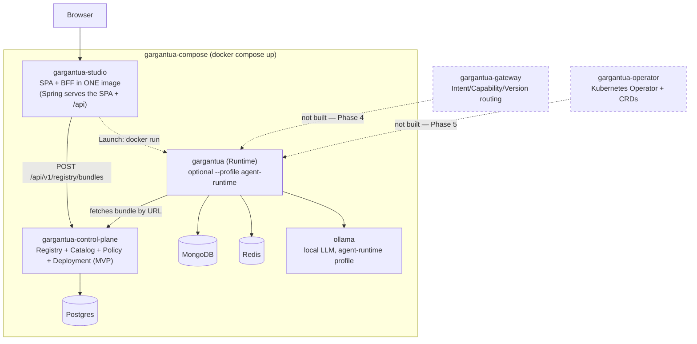
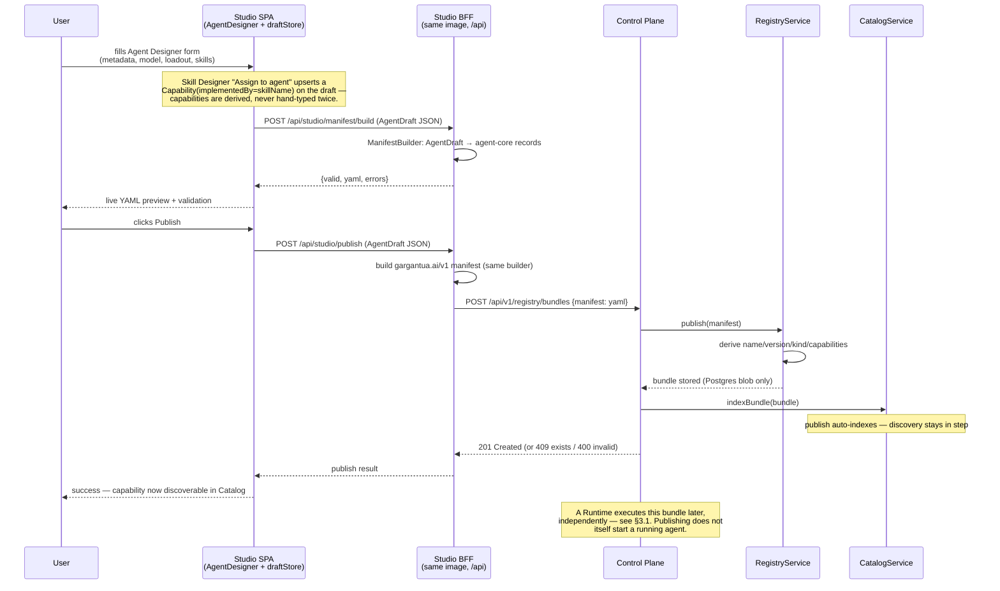

# Platform Handoff — Gargantua AI Operating System

**Read this first when resuming work on the *platform* (any repo).** It is the
cross-repository map: where every component lives, what is built, what is decided,
and what comes next. It complements — does not replace — two narrower docs:

- [`../project-handoff.md`](../project-handoff.md) — orientation for the **Runtime
  repository** internals (modules, invariants, delivery modes).
- [`ai-operating-system.md`](ai-operating-system.md) — the **vision** (the north
  star, not a sprint plan).

**Last updated:** 2026-08-30. If a fact here disagrees with the code, the code wins —
fix this doc. For changes made in the 2026-08-30 session, see
[`SESSION_HANDOFF_2026-08-30.md`](SESSION_HANDOFF_2026-08-30.md) (and
[`SESSION_HANDOFF_2026-08-29.md`](SESSION_HANDOFF_2026-08-29.md),
[`SESSION_HANDOFF_2026-08-28.md`](SESSION_HANDOFF_2026-08-28.md) before it).

**Recent progress (most recent first):** **PACT Core, end to end** — the Runtime's
manifest (`gargantua.ai/v1`) covers all seven pillars of
[PACT](../../PACT_v0.3_Agent_Contract_Specification.md), a small agent-description spec
drafted in this repo for eventual submission to AAIF, *and* the Studio Agent Designer can
now author `spec.cognition`/`spec.contract`/`spec.interfaces` through real form sections
(`Identity`/`Purpose` are derived from existing metadata fields, no dedicated field) —
only a live `/.well-known/pact.json` endpoint remains unbuilt → **Multi-Control-Plane
Settings** — Studio can
now register several named Control Planes and connect/disconnect/switch between them at
runtime (no restart), and the CP-optional workflow (create/save locally with the Control
Plane off; only publish/reads fail, cleanly) has been verified live, not just assumed →
**Real concurrent multi-agent hosting** — the Studio Launch button gives every agent its
own container + host port instead of one shared slot that got replaced on every launch,
and the Control Plane's Deployment subsystem tracks each one's port (§3.1, §8) → a chain
of Playground bugs fixed (insecure-context crash, hardcoded-localhost runtime URL, CORS
pinned to one origin) → Agent Graph rewritten as a connected radial layout →
Postgres-only bundle storage (MinIO/S3 removed) → Studio merged into one repo/image
(SPA + BFF). See §7 for the roadmap and what's next.

---

## 1. What Gargantua is (one paragraph)

Gargantua is an open-source, distributed **AI Operating System**: you *declare* an
agent (its model, skills, capabilities, MCP tools, memory, guardrails) and the
platform builds, catalogs, deploys and runs it. It borrows the Kubernetes control
loop shape — a **Control Plane defines** desired state, a **Runtime applies** it —
but **Kubernetes is never required to use it**. The whole platform must be runnable
locally with Docker Compose; K8s/the Operator/CRDs are an additive Phase 5.

## 2. Repository map

Development happens locally in **Cave** (web IDE + terminal); **origin is Forgejo**
(`http://forgejo:3000/gbrescia/<repo>.git`). All repos are on branch `main`. Some
also mirror to GitHub (`GiskardB`). Sibling repos are checked out side by side under
`/home/dev/workspace/`.

| Repo | Role | Stack | Status (2026-08) |
|---|---|---|---|
| `gargantua` | **Runtime** + execution-side Kernel; **home of all architecture docs**; publishes `agent-core`; also home of the draft [PACT spec](../../PACT_v0.3_Agent_Contract_Specification.md) | Java 25 / Spring Boot 4.1, 9 Maven modules | Phase 1 + loadout + governance parsing + PACT Core fields; docs hub; on `1.4.0-SNAPSHOT` |
| `gargantua-control-plane` | **Control Plane**: Registry + Catalog + Policy + Deployment (now with per-agent port tracking + undeploy) | Java 25 / Boot 4.1, `agent-core` | **MVP** — publish→index→discovery works; Deployment tracks real running instances; 28 tests |
| `gargantua-studio` | **Studio** — frontend **and** BFF in ONE repo / ONE image (Spring serves the SPA at `/`, API at `/api`). Agent+Skill Designer, radial graph editor, Publish dialog, Playground (multi-agent aware) against real runtimes, Launch button (concurrent, per-agent). | React 18 / Vite 5 / XYFlow (in `frontend/`) + Java 25 / Boot 4.1 BFF (`agent-core`) | **MVP** — merged 2026-08; concurrent multi-agent launch 2026-08-29; 55 backend tests; 8 frontend tests; TypeScript clean |
| ~~`gargantua-studio-backend`~~ | **Merged into `gargantua-studio`** (2026-08) — no longer a separate repo/image | — | Deprecated |
| `gargantua-compose` | **Local vertical slice** (Docker Compose) wiring the agent-creation flow; `start.bat`/`stop.bat` | Compose v2 | **Done** — ports in 18xxx/19xxx (off Cave's range); authored + statically verified |
| `gargantua-gateway` | Agent Gateway (Intent/Capability/Version routing) | TBD | **Not built** — Phase 4; decision: *evaluate `agentgateway`* first |
| `gargantua-operator` | Kubernetes Operator + CRDs | Java Operator SDK (planned) | **Not built** — Phase 5 |

## 3. The shared domain model — `agent-core`

The single most important structural decision after the multi-repo split:
**all JVM components share ONE canonical domain model**, not local mirrors.

- Coordinates: `io.github.giskardb:agent-core` — released versions are **published to
  Maven Central** (`1.2.20` is the latest released; the working tree went to
  `1.3.0-SNAPSHOT` locally for the Agent Loadout change, then to **`1.4.0-SNAPSHOT`**
  for the PACT Core fields below — install it to `.m2`, see below). Released versions
  mean sibling repos and Docker builds resolve it normally; you do **not** need the
  Runtime checked out to build the Control Plane or Studio backend. A SNAPSHOT, however,
  is local-only until tagged/released — see roadmap §7.2.
- It is a **module of `gargantua-parent`** (which extends `spring-boot-starter-parent
  4.1.0`). Pure domain: **no Spring, no Jackson annotations.** YAML↔record binding
  lives in the Runtime's `agent-bundle/ManifestParser` and in the Studio backend's
  `ManifestBuilder` — never in the model.
- To refresh the local `.m2` after changing it, from the Runtime repo:
  `mvn -N install && mvn -pl agent-core install -DskipTests`.
- Key types: `WorkloadManifest` (apiVersion/kind/metadata/spec; `CURRENT_API_VERSION
  = "gargantua.ai/v1"`), `WorkloadMetadata` (name/version/description/owner/labels +
  **`governance`**, implements `Governed`), `AgentSpec` (runtime, capabilities, model,
  mcpServers, memoryLayers, defaultSkill, guardrails, allowedRoles, `loadout`,
  **`cognition`, `contract`, `interfaces`**),
  `Loadout`/`KnowledgeRef`/`ResourceRef` (`core.workload`),
  `GovernanceEnvelope`/`Visibility`/`Governed` (`core.governance`), `Capability`
  (name, description, version, inputSchema, outputSchema, **`implementedBy`**,
  `Set<String> tags`), `SkillMeta`/`SkillCard`, `RagConfig`, `McpServerSpec`,
  `MemoryLayer`, A2A (`AgentCard`), rag ports (`EmbeddingPort`, `VectorStorePort`).
- **`core.pact`** (new, 2026-08-30): `Cognition`/`CognitionModels`/`CognitionRequirements`/
  `ModelDescriptor`, `Contract`/`Autonomy` (enum), `InterfaceEndpoint`, `Identity`,
  `Purpose`, and `PactManifest` — a projector (`PactManifest.from(WorkloadManifest)`)
  onto a standalone [PACT](../../PACT_v0.3_Agent_Contract_Specification.md) v1 Core
  document. `Identity`/`Purpose` have no manifest field of their own; they're derived
  from `metadata.owner`/`metadata.description`. See
  [agent-manifest.md](agent-manifest.md#relationship-to-pact) for the full pillar
  mapping and [`SESSION_HANDOFF_2026-08-30.md`](SESSION_HANDOFF_2026-08-30.md) for how
  this came about.

See [gargantua-domain-model.md](gargantua-domain-model.md) for the full model.

## 3.1 Macro architecture

What's actually built (solid) vs. planned (dashed) as of this doc, and how it maps to the
`gargantua-compose` slice:



All JVM boxes (`Studio`, `CP`, `Runtime`) share the one `agent-core` domain model (§3).
`Runtime` fetches its bundle from the Control Plane at startup (`GARGANTUA_BUNDLE_URL` →
`GET /bundles/{name}/{version}/bundle`); the Studio's **Launch** button starts a runtime
pointed at a freshly published bundle (see §8 for the loop and its caveats). The `Runtime`
box in the diagram can be **several concurrent containers**, not one — each launched
agent (by name) gets its own container and host port (2026-08-29), so the platform can
run and serve multiple agents at once instead of one launch replacing the last.

## 4. How to run the whole thing locally (the `gargantua-compose` slice)

This is the answer to *"does Studio emit something the rest of the platform accepts?"*

```
browser ─▶ studio            ONE image: Spring serves the SPA (/) + BFF API (/api)
              └─▶ control-plane   Registry + Catalog
                     ├─▶ postgres   control-plane + studio state + bundle blobs
```

```bash
cd gargantua-compose
cp .env.example .env                    # optional; defaults work
docker compose up -d --build --wait     # Windows: start.bat  (stop.bat / stop.bat clean)
./smoke/smoke.sh                        # build → publish → catalog round-trip
```

Studio UI at `http://localhost:18081` (or `http://<CAVE_HOST>:18081`). The SPA talks
to the backend **same-origin** (Spring serves the SPA at `/` and the BFF API at `/api` on
the same origin), so it works on localhost or a LAN IP without CORS or a per-host rebuild.
Published ports live in a high range (**18080** CP, **18081** Studio) so they never clash
with Cave's own services; override any of them in `.env`.

**Static preview (no backend):** the built Studio is published via `cave-publish` at
**`https://<CAVE_HOST>:7443/gargantua-studio/`** (CAVE_HOST=192.168.1.118) so it can be
viewed without running anything. It runs offline/mock there (a published static site
can't reach a localhost backend) — Loadout, Governance and the Trace Explorer show sample
data. Re-publish after a UI change: `npm run build` then copy `dist/` into
`~/workspace/sites/gargantua-studio/`.

**Scope of the slice:** the core 5 services cover *creating* an agent (Studio → backend
→ Control Plane). *Running* an agent is now an **opt-in second loop** — `docker compose
--profile agent-runtime up` adds `ollama` (local, OpenAI-compatible LLM, no external key),
a one-shot model pull, and `runtime` (the generic Runtime image with a demo bundle
`examples/hello-agent` baked in — `embedded` Spring profile = in-memory, no Mongo/Redis;
`semantic` ONNX routing). **Verified end to end (2026-08):** the bundle boots, `greeter-skill`
registers, and `POST :18100/api/agent/chat` returns a real LLM-generated reply routed
SEMANTICally to the skill. Note: the bundle is **baked into the image** (build-time COPY),
not bind-mounted — a workspace bind mount arrives empty when the daemon is remote (Cave).

**Verified end-to-end against a live Docker daemon (2026-08).** `docker` + `docker compose`
became available in the Cave IDE box mid-session (`DOCKER_HOST=tcp://socket-proxy:2375` —
the daemon runs on a different host than the IDE shell, same as Portainer's). Built and ran
the full stack; all 5 containers reported healthy and `smoke/smoke.sh` passed end to end —
confirmed against the real Control Plane response (a `smoke-agent@1.0.0` bundle with its
capability actually in the Catalog), and separately exercised `/api/studio/manifest/build`
with a full Loadout + Governance draft and got back correct canonical YAML.

Three real bugs were found and fixed this way (all pushed):
1. **`additional_contexts` needs BuildKit** — the classic builder rejects it outright
   (`the classic builder doesn't support additional contexts`). Prefix build/up with
   `DOCKER_BUILDKIT=1` if your Docker doesn't default to it.
2. **`mvn -N install` validates the whole reactor**, not just the module being installed —
   copying only `pom.xml` + `agent-core/` into the `agentcore` build stage failed with
   `Child module ... does not exist` for the other 8 modules, even non-recursively. Fixed by
   copying the **whole Runtime repo** into that stage instead (added a `.dockerignore` to
   `gargantua` — excludes `target/`, `.git` — so this stays cheap).
3. **The `studio` (nginx) healthcheck used `localhost`**, which resolves to `::1` first
   inside the container; the image only listens on IPv4 (`0.0.0.0:80`, no `listen [::]:80`
   in our `nginx.conf`), so the healthcheck failed with "Connection refused" while nginx was
   serving fine. Fixed by probing `127.0.0.1` instead.

**The published-ports gotcha:** if the Docker daemon isn't on the same host as your shell
(true in Cave — `DOCKER_HOST` points at a remote daemon), `curl localhost:18080` will
refuse to connect even though the containers are healthy — the ports are bound on the
*daemon's* host, not the shell's. Use the actual Docker host address (in Cave, `<CAVE_HOST>`)
instead; see the `gargantua-compose` README for detail.

Ports default to the 18xxx range so they don't clash with Cave's own services.
The images build `agent-core` from source (context
`runtime_src=../gargantua`), so no Maven Central release is needed — but the `gargantua`
repo must be a sibling checkout.

**Build toolchain note (2026-08):** the Cave IDE box was re-provisioned mid-session
**without Java/Maven**. If `mvn`/`java` are missing, install a portable toolchain (this is
what the recent JVM work was built/verified with):
```bash
# Temurin JDK 25 + Maven 3.9.9 under ~/tools
curl -fsSL -o ~/tools/jdk25.tar.gz "https://api.adoptium.net/v3/binary/latest/25/ga/linux/x64/jdk/hotspot/normal/eclipse"
curl -fsSL -o ~/tools/maven.tar.gz "https://archive.apache.org/dist/maven/maven-3/3.9.9/binaries/apache-maven-3.9.9-bin.tar.gz"
# extract both under ~/tools, then:
export JAVA_HOME=~/tools/jdk-25.0.4.1+1
export PATH=$JAVA_HOME/bin:~/tools/apache-maven-3.9.9/bin:$PATH
```

## 5. The agent-creation flow (contracts, end to end)

How clicking "Publish" in the Studio's Agent Designer turns a form into a Catalog entry:



| Hop | Call | Notes |
|---|---|---|
| SPA → backend | `POST /api/studio/manifest/build` (body: `AgentDraft` JSON) | returns `{valid, yaml, errors}`; stringly-typed form draft → `agent-core` records → canonical YAML |
| SPA → backend | `POST /api/studio/publish` (body: `AgentDraft`) | builds then relays to the Control Plane; 201 created / 409 exists / 400 invalid |
| backend → CP | `POST /api/v1/registry/bundles` (body: `{"manifest": "<yaml>"}`) | `PublishRequest`; CP derives name/version/kind/capabilities from the manifest |
| CP internal | `RegistryService.publish` → `CatalogService.indexBundle` | publishing **auto-indexes** the Catalog — discovery stays in step |
| SPA → backend → CP | `GET /api/studio/{workloads,capabilities,policies,deployments}` | read-through to `/api/v1/{registry/bundles, catalog/capabilities, policies, deployments}` |

Ports: Control Plane **8080**, Studio backend **8090**. Postgres is unpublished
(internal only). In dev the JVM services default to embedded H2 + filesystem blobs;
the compose slice activates the `postgres` Spring profile. Bundle blobs live in the
same Postgres database as the rest of Control Plane state (no separate object store
since 2026-08-28).

## 6. Frozen decisions (do not relitigate without a reason)

Full rationale in memory and in the linked docs; the load-bearing ones:

- **Docker Compose is a hard requirement.** Trying the whole platform must never
  require Kubernetes. (See `ai-operating-system.md`, and §4 above.)
- **The manifest keeps the `apiVersion/kind/metadata/spec` shape.** It is the agent's
  own declarative spec (Control-Plane-native, *not* consumed by kubectl); it only
  *borrows* the k8s envelope so the future Operator can transcribe it into a CRD
  almost mechanically. Confirmed with the user — not a k8s manifest. See
  [agent-manifest.md](agent-manifest.md).
- **Capability ≠ Skill, kept decoupled in the model.** A **Skill** is authored as a
  `SKILL.md` (Anthropic Agent Skills format: YAML frontmatter + markdown system
  prompt); a **Capability** is the external Catalog contract. Studio bridges them at
  the **UX layer**: the Skill Designer builds a canonical `SKILL.md`, and "Assign to
  agent" upserts a Capability keyed by `implementedBy = skill.name`. The domain
  decoupling stays (Runtime routing/Catalog depend on it). See
  [skills-and-routing.md](../skills-and-routing.md).
- **Shared `agent-core` jar, not mirrored types.** (§3.)
- **Stack (frozen):** Java 25 LTS + Boot 4.1 + Maven everywhere; Postgres
  (control-plane state + bundle blobs), MongoDB (runtime state), Redis (cache/rate-limit);
  A2A + MCP as interop; React Flow / Monaco / Zustand for Studio.
  Vector search stays pluggable (pgvector / Qdrant / in-memory behind `EmbeddingPort`).
- **Gateway: evaluate `agentgateway` before building** (Rust; MCP/A2A/LLM proxy, CEL
  policy, RBAC, rate-limit, OTel). Gargantua keeps the **Intent Router** as its value
  *in front of* the gateway; delegates protocol proxy/security/telemetry. Rust/Go is
  fine — don't rewrite solved networking in Java for uniformity.

## 7. Roadmap — decided improvements, in order

Derived from a critical evaluation of an external agent-infra research doc; the full
ADOPT/ADAPT/EVALUATE/REJECT analysis, grounded in the codebase, is in
[13-open-source-patterns.md](13-open-source-patterns.md). The **decision lens** (adopt
its most useful contribution): for any idea ask — is it a protocol / domain object /
control-plane cap / runtime cap / context cap / *impl detail* / *external infra*? If
the last two, adopt a standard or component instead of reinventing it.

1. ✅ **Docker Compose vertical slice** — done (`gargantua-compose`).
2. ✅ **Agent Loadout (ADOPT, P0)** — done. `spec.loadout` (knowledge / memoryScopes /
   skills / resources) added to `agent-core` (`Loadout`, `KnowledgeRef`, `ResourceRef`;
   `AgentSpec.loadout`, additive), parsed by the Runtime's `ManifestParser`, emitted by the
   Studio backend's `ManifestBuilder`, and editable in the Studio Agent Designer (knowledge
   bases first-class, with `maxResults`/`minScore` retrieval overrides). Bumped the shared
   model to **`1.3.0-SNAPSHOT`**. Reported as an unapplied field for now — runtime
   provisioning of a loadout is not implemented (knowledge is still wired per skill via
   `SKILL.md metadata.knowledge-base`). **Version note:** `1.3.0-SNAPSHOT` lives only in the
   local `.m2`. The `gargantua-compose` Docker images now **build agent-core from source**
   (named build context `runtime_src=../gargantua`), so the stack no longer needs `agent-core`
   on Maven Central — publishing `v1.3.0` is still wanted for sibling repos that consume it as
   a released dependency, but it's no longer a blocker for running the compose.
3. ✅ **PACT Core fields (ADOPT, P1)** — done, 2026-08-30. `spec.cognition`, `spec.contract`
   (`Autonomy` enum + permissions) and `spec.interfaces` added to `agent-core`
   (`core.pact`), parsed by the Runtime's `ManifestParser`, and projected onto a
   standalone [PACT](../../PACT_v0.3_Agent_Contract_Specification.md) v1 Core document by
   `PactManifest.from(WorkloadManifest)`. All seven PACT pillars are now covered — Identity/
   Purpose have no dedicated field, derived from `metadata.owner`/`metadata.description`
   instead. Bumped the shared model to **`1.4.0-SNAPSHOT`**. Unlike Loadout/Governance
   below, these are *not* "reported, not enforced yet" gaps — PACT's own "Declaration vs
   Verification" principle (§31) means no enforcement is planned for them, by design.
   **Not yet done:** Studio/Designer has no UI for these fields (still on `agent-core
   1.3.0-SNAPSHOT`), and there is no live serialization/endpoint (`PactManifest` is a Java
   projection only, no `/.well-known/pact.json` yet). See
   [`SESSION_HANDOFF_2026-08-30.md`](SESSION_HANDOFF_2026-08-30.md).
4. ✅ **Governance envelope (ADAPT, P1)** — first increment done. `core.governance`:
   `GovernanceEnvelope` (tenant / visibility[PRIVATE·INTERNAL·PUBLIC] / status / access /
   createdAt / updatedAt) + a `Governed` interface (a **shared trait**, *not* a
   `ContextAsset` supertype). Attached additively to `WorkloadMetadata` (`metadata.governance`)
   — parsed by the Runtime, emitted by the Studio backend, edited in the Studio Agent
   Designer. Timestamps are Control-Plane-assigned (never in a bundle). Reported, not yet
   enforced (Policy Manager owns enforcement). **Follow-on:** apply the same `Governed` trait
   to `Capability` / `SkillMeta` / memory / knowledge (cheap now the trait exists).
5. **◕ MOSTLY DONE — Execution event model + Trace (ADOPT, P1).** `agent-core`
   `core.execution`: `ExecutionEvent` (OTel-friendly: typed + attributes map),
   `ExecutionEventType`, `ExecutionTrace`, and the `ExecutionEventPublisher` **port**
   (noOp default — keeps the NATS/Kafka/none choice open). The **engine now emits** a
   per-turn trace (TURN_STARTED → ROUTING_DECIDED → SKILL_SELECTED → LLM_CALL → TOOL_CALLED
   → TURN_COMPLETED / ERROR), best-effort and additive. Default sink is an
   `InMemoryExecutionEventPublisher` (bounded ring); **`GET /api/traces` + `/api/traces/{id}`**
   expose it. Distinct from `AuditEvent` (one post-hoc summary). Verified live: real chats
   produce real traces via the API. The Studio has a **Trace Explorer** (`/trace`) on sample
   data. **Remaining follow-on:** (a) point the Trace Explorer at a runtime's `/api/traces`
   (per-agent service — needs a target-runtime selector, or surface traces through a
   central collector); (b) an OTel exporter implementation of the port; (c) finer events
   (guardrail verdicts, memory read/write, per-tool results).
6. **Runtime supervisor + execution budgets (ADOPT, P1)** — timeout/loop/thrash/cost
   caps (partial today via `TokenBudgetManager`/cost tracking).
7. **Agent lifecycle + evaluation gate (ADAPT, P1)** — DRAFT→…→ACTIVE; no publish
   without passing evaluation.
8. **Phase 4:** agentgateway evaluation spike (§6). **Phase 5:** Operator + CRDs + GitOps.
9. ✅ **PACT Designer support** — done, 2026-08-30. Studio's `agent-core`/`agent-bundle`
   bumped to `1.4.0-SNAPSHOT`; the Agent Designer has new Cognition/Contract/Interfaces
   sections (`AgentDraftRequest`/`ManifestBuilder` wire them through build/validate/
   toDraft, matching the Loadout/Governance pattern). Verified live: built a real
   manifest through the deployed backend with all three sections populated. **Still not
   done:** a live `/.well-known/pact.json` endpoint on the Runtime — `PactManifest.from`
   remains a Java-only projection, nothing serves it over HTTP yet.

Deferred/optional (keep the model open, don't build yet): Experience→Skill (P2),
progressive disclosure + per-source context budget, sandbox provider abstraction,
memory versioning/branching + graph memory (research).

**Explicitly resisted:** ContextAsset type-unification; adopting NATS now (hide behind
an `EventPublisher` if events land — NATS-vs-Kafka stays open); a "modular monolith"
(contradicts the distributed multi-repo architecture — decision stands); generating all
13 arch docs up front.

## 8. Known gaps & honest caveats

- **Not everything in the manifest is enforced yet** — see the Runtime's
  `ManifestProperties.unappliedFields()` and `project-handoff.md` §4. In particular
  `spec.loadout` and `metadata.governance` are **parsed and reported, not enforced**:
  loadout provisioning isn't implemented (knowledge is wired per skill via
  `SKILL.md metadata.knowledge-base`), and governance visibility/access await the Policy Manager.
- **Governance is only on the agent so far** — `Governed` is implemented by
  `WorkloadMetadata`; applying it to `Capability`/`SkillMeta`/memory/knowledge is a
  planned follow-on (see §7.3).
- **Execution events flow at runtime** — the engine emits them, an in-memory sink retains
  the recent ones, and `GET /api/traces` serves them. The Studio **Trace Explorer** and
  **Playground** now read a runtime directly (a user-set Runtime URL; the runtime opts into
  CORS via `agent.web.cors.allowed-origins`). Still open: an OTel exporter and finer-grained
  events (guardrail verdicts, memory read/write, per-tool results) (§7.4).
- **The full create→launch→test loop works** (verified live, `gargantua-compose`): Studio
  publishes a manifest **plus skill content**; the Control Plane stores a runnable `.gbundle`
  (`GET /bundles/{n}/{v}/bundle`); the Runtime **fetches its bundle by URL**
  (`GARGANTUA_BUNDLE_URL`) instead of a baked/mounted one; and a Studio **Launch** button has
  `studio-backend` run an editable command (`docker run`) to start a runtime pointed at the
  bundle. **Caveats:** the launch command runs with the backend's Docker privileges —
  local-dev/demo only, never expose it. The Runtime still hosts **one agent per process**
  (ADR-001): "launch" recreates *that agent's* runtime container, it does not hot-swap —
  but as of 2026-08-29 that's a per-agent-name container/port, not one shared slot, so
  **several agents run concurrently** (verified live: 3 agents, 3 containers, 3 ports,
  all answering chat independently). The Control Plane's Deployment subsystem **does now
  track running instances** — `Deployment.port`, updated by Studio's `LaunchService`
  once a health check confirms the container actually answers — which is what lets the
  Playground list genuinely-reachable agents instead of guessing. Still true: a manifest
  that pins a cloud model (e.g. `gpt-4o`) won't run against the local Ollama the `cave`
  profile wires up; leave the model blank or set it to the local tag for the demo. Also
  still open: relaunching a *newer version* of the same agent name reuses its container/
  port correctly, but the old version's deployment record isn't marked superseded, so it
  lingers as a second (harmless but confusing) `HEALTHY` entry — see
  `SESSION_HANDOFF_2026-08-29.md` §"medium priority".
- **Studio works with the Control Plane switched off** (verified live, not just assumed):
  creating/saving skills and drafts, building/validating manifests, and downloading
  `.gbundle` bundles all work; only publish and CP-proxied reads fail, cleanly (502, clear
  message). Studio can also be pointed at **more than one Control Plane** — a `/settings`
  screen registers named CP configs and switches the active one at runtime, no restart
  (`ControlPlaneRegistry`/`ControlPlaneClient`, see `SESSION_HANDOFF_2026-08-29.md`).
- **Bundle *signature* verification** is not implemented (SHA-256 checksum is). The bundle
  zip the Control Plane assembles is likewise unsigned.
- The Control Plane is an **MVP**: Registry/Catalog/Policy/Deployment exist; auth is
  permit-all in dev (OIDC/Keycloak profile stubbed), no RBAC enforcement yet.
- The Studio backend security is **permit-all in dev**, JWT under the `oidc` profile.
- Docker availability in the Cave IDE env has flipped state at least once mid-project —
  it works now (verified, §4) but treat it as environment-dependent, not guaranteed.
  Java/Maven may also be missing after a re-provision — restore a portable toolchain
  (§4 build note) if `mvn`/`java` vanish.

## 9. Where to go next in the docs

- Runtime internals & invariants → [`../project-handoff.md`](../project-handoff.md)
- Vision → [`ai-operating-system.md`](ai-operating-system.md)
- Binding decisions (ADR-001..006) → [`runtime-decisions.md`](runtime-decisions.md)
- **Session handoff (2026-08-30)** → [`SESSION_HANDOFF_2026-08-30.md`](SESSION_HANDOFF_2026-08-30.md)
- **Session handoff (2026-08-29)** → [`SESSION_HANDOFF_2026-08-29.md`](SESSION_HANDOFF_2026-08-29.md)
- **Session handoff (2026-08-28)** → [`SESSION_HANDOFF_2026-08-28.md`](SESSION_HANDOFF_2026-08-28.md)
- Domain model → [`gargantua-domain-model.md`](gargantua-domain-model.md)
- Manifest schema & enforcement → [`agent-manifest.md`](agent-manifest.md)
- Skills & routing → [`skills-and-routing.md`](../skills-and-routing.md)
- OSS pattern evaluation & the roadmap rationale → [`13-open-source-patterns.md`](13-open-source-patterns.md)
